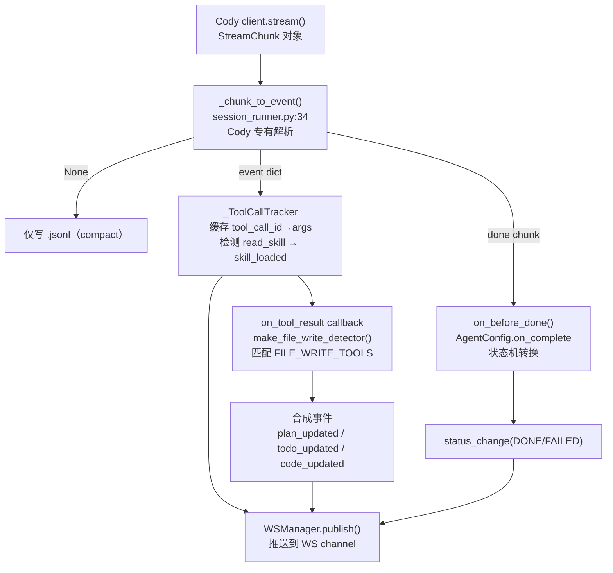
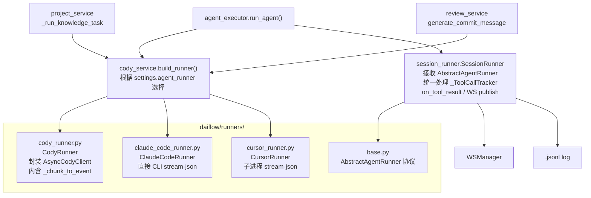

# Agent Runner 抽象层改造方案

## 一、当前 Cody 耦合点全景

系统有 **4 处直接依赖 Cody SDK** 的地方，分布在 3 个文件：

`**[daiflow/session_runner.py](daiflow/session_runner.py)`**

- `SessionRunner.__init__(cody_client)` — 接收 Cody 专有客户端
- `_chunk_to_event(chunk)` — 解析 Cody `StreamChunk` 对象
- `async for chunk in self.client.stream(...)` — 调用 Cody 流式 API
- `run_stage_chat()` — 同样直接调用 `cody_client.stream()`

`**[daiflow/agent_executor.py](daiflow/agent_executor.py)`**

- `build_task_cody_client(db, task_id, project_id)` — 硬编码构造 Cody client

`**[daiflow/services/project_service.py](daiflow/services/project_service.py)`**（`_run_knowledge_task`）和**  
`****[daiflow/services/review_service.py](daiflow/services/review_service.py)`**（`generate_commit_message`）

- 直接调用 `build_cody_client()` 和 `client.stream()`

---

## 二、事件转换链（当前）




### Cody StreamChunk → DaiFlow Event 映射


| Cody `chunk.type`          | DaiFlow `event.type`                             | 推送 WS？                 |
| -------------------------- | ------------------------------------------------ | ---------------------- |
| `text_delta`               | `text_delta`                                     | 是                      |
| `thinking`                 | `thinking`                                       | 是                      |
| `tool_call`                | `tool_call`                                      | 是                      |
| `tool_result`              | `tool_result`                                    | 是                      |
| `compact`                  | `compact`                                        | 否（仅 log）               |
| `done`                     | 触发后处理，不直接推                                       | 否 → 改推 `status_change` |
| `tool_call{read_skill}`    | `skill_loaded`（合成）                               | 是                      |
| `tool_result` + file write | `plan_updated`/`todo_updated`/`code_updated`（合成） | 是                      |


---

## 三、第一部分：改造现有系统（不破坏功能）

### 3.1 新建 `daiflow/runners/` 包

`**daiflow/runners/base.py**` — AbstractAgentRunner 协议

```python
from typing import AsyncIterator, Any, Protocol, runtime_checkable

@runtime_checkable
class AbstractAgentRunner(Protocol):
    """所有 runner 必须实现的协议。stream() 直接 yield DaiFlow event dict。"""

    async def stream(
        self,
        prompt: "str | Any",        # str 或 MultimodalPrompt
        session_id: str | None = None,  # runner 原生 session ID（用于多轮续话）
    ) -> AsyncIterator[dict]:
        """
        异步生成器，yield DaiFlow event dict。
        
        必须 yield 的 event 类型（与现有前端协议一致）：
          {"type": "text_delta",  "content": str}
          {"type": "thinking",    "content": str}
          {"type": "tool_call",   "tool_name": str, "args": dict, "tool_call_id": str}
          {"type": "tool_result", "tool_name": str, "content": str, "tool_call_id": str}
          {"type": "done", "usage": {"input_tokens": int, "output_tokens": int},
                           "runner_session_id": str | None}
        
        可选 yield：
          {"type": "compact"}  # 仅触发 log，不推 WS
        """
        ...

    async def __aenter__(self) -> "AbstractAgentRunner": ...
    async def __aexit__(self, exc_type, exc_val, exc_tb) -> None: ...
```

关键设计决策：

- `done` event 携带 `runner_session_id`（原 `chunk.session_id`），SessionRunner 从 done event 中读取，存入 `sessions.cody_session_id` 列（字段名保持不变，语义变为"runner native session ID"）
- `_chunk_to_event()` 和 Cody 特有解析逻辑**全部迁移到 `CodyRunner` 内部**
- `_ToolCallTracker`（tool_call_id 缓存 + `read_skill` 检测）**留在 SessionRunner**，因为所有 runner 都会 yield 带 `tool_call_id` 的事件，文件写入检测机制对所有 runner 通用

`**daiflow/runners/cody_runner.py`** — 现有 Cody 逻辑的直接搬移

将 `session_runner.py` 中的 `_chunk_to_event()` 搬到此处，包装 `AsyncCodyClient`：

```python
class CodyRunner:
    def __init__(self, cody_client):
        self._client = cody_client

    async def stream(self, prompt, session_id=None):
        kwargs = {"session_id": session_id} if session_id else {}
        async for chunk in self._client.stream(prompt, **kwargs):
            event = _chunk_to_event(chunk)  # 搬移自 session_runner.py
            if event is None:
                yield {"type": "compact"}
                continue
            if event["type"] == "done" and hasattr(chunk, "session_id"):
                event["runner_session_id"] = chunk.session_id
            yield event

    async def __aenter__(self): await self._client.__aenter__(); return self
    async def __aexit__(self, *args): await self._client.__aexit__(*args)
```

### 3.2 改造 `SessionRunner`

`**session_runner.py**` 的改动最小化：

```python
# 改前
class SessionRunner:
    def __init__(self, cody_client, ws_manager=None):
        self.client = cody_client
        ...
    
    async def run(self, ...):
        async for chunk in self.client.stream(prompt, **stream_kwargs):
            event = _chunk_to_event(chunk)     # 删除
            if hasattr(chunk, "session_id"):   # 删除
                result_cody_session_id = ...   # 改为从 done event 读取

# 改后
class SessionRunner:
    def __init__(self, runner: AbstractAgentRunner, ws_manager=None):
        self.runner = runner    # 原 self.client
        ...
    
    async def run(self, ...):
        async for event in self.runner.stream(prompt, session_id=cody_session_id):
            if event["type"] == "compact":
                await append_log(session_id, {"type": "compact", "ts": _now_iso()})
                continue
            if event["type"] == "done":
                result_cody_session_id = event.get("runner_session_id")
                ...  # 后处理逻辑不变
                continue
            # 后续逻辑完全不变（tracker、on_tool_result、ws_publish）
```

`run_stage_chat()` 同理，将 `cody_client.stream()` 改为 `runner.stream()`。

### 3.3 改造 `agent_executor.py`

在 `cody_service.py` 新增工厂函数（不删除 `build_cody_client`）：

```python
# cody_service.py 新增
async def build_runner(db, workdir, allowed_roots, skill_dir=None) -> AbstractAgentRunner:
    """Runner 工厂：根据 settings 中的 agent_runner 配置选择实现。"""
    runner_type = await get_setting(db, "agent_runner", default="cody")
    if runner_type == "claude_code":
        from daiflow.runners.claude_code_runner import ClaudeCodeRunner
        settings = await get_claude_code_settings(db)
        return ClaudeCodeRunner(workdir=workdir, allowed_roots=allowed_roots, **settings)
    elif runner_type == "cursor":
        from daiflow.runners.cursor_runner import CursorRunner
        return CursorRunner(workdir=workdir)
    else:  # default: cody
        from daiflow.runners.cody_runner import CodyRunner
        client = await build_cody_client(db, workdir, allowed_roots, skill_dir)
        return CodyRunner(client)

async def build_task_runner(db, task_id, project_id) -> AbstractAgentRunner:
    """Convenience wrapper（对应现有 build_task_cody_client）。"""
    task_dir = get_task_dir(task_id)
    _, allowed_roots = await get_task_context(db, task_id, project_id)
    skill_dir = str(get_task_skills_dir(task_id))
    return await build_runner(db, str(task_dir), allowed_roots, skill_dir)
```

`agent_executor.run_agent()` 第 4 步改为：

```python
# 改前
client = await build_task_cody_client(db, ctx.task.id, ctx.project_id)
runner = SessionRunner(client)
async with client:
    await runner.run(...)

# 改后
runner = await build_task_runner(db, ctx.task.id, ctx.project_id)
session_runner = SessionRunner(runner)
async with runner:
    await session_runner.run(...)
```

`project_service._run_knowledge_task()` 和 `review_service.generate_commit_message()` 同步切换到 `build_runner()`。

### 3.4 改动范围总结（零破坏）


| 文件                                      | 改动内容                                                                                                   |
| --------------------------------------- | ------------------------------------------------------------------------------------------------------ |
| **新增** `daiflow/runners/__init__.py`    | 包导出                                                                                                    |
| **新增** `daiflow/runners/base.py`        | AbstractAgentRunner 协议                                                                                 |
| **新增** `daiflow/runners/cody_runner.py` | CodyRunner（搬移 _chunk_to_event）                                                                         |
| `daiflow/session_runner.py`             | `SessionRunner.__init__` 参数名改为 `runner`；循环改为 `runner.stream()`；删除 `_chunk_to_event` 函数（已迁入 CodyRunner） |
| `daiflow/services/cody_service.py`      | 新增 `build_runner()` + `build_task_runner()`；保留所有现有函数                                                   |
| `daiflow/agent_executor.py`             | 第4步切换到 `build_task_runner()`                                                                           |
| `daiflow/services/project_service.py`   | `_run_knowledge_task` 切换到 `build_runner()`                                                             |
| `daiflow/services/review_service.py`    | `generate_commit_message` 切换到 `build_runner()` 的简化流                                                    |


无需改动：`WSManager`、`AgentConfig`/`AgentContext`、所有 router、前端 WS 协议、`.jsonl` 格式、状态机。

---

## 四、第二部分：Claude Code 接入调研

### 4.1 通信方式

DaiFlow 的 **ClaudeCodeRunner** 与 CursorRunner 一致：**直接以子进程方式启动 Claude Code CLI**，通过 stdin/stdout 的 NDJSON 协议通信，不依赖 `claude-agent-sdk`。协议与 SDK 使用的 stream-json 格式兼容（`control_request` / `control_response`、`stream_event`、`result`）。

安装 Claude Code CLI（需在 PATH 中可用 `claude`）：

```bash
npm install -g @anthropic-ai/claude-code
```

Runner 启动命令形如：

```bash
claude --output-format stream-json --verbose --input-format stream-json \
  --system-prompt "" --allowedTools "Read,Write,Edit,Bash,..." \
  --permission-mode bypassPermissions --include-partial-messages \
  --resume <session_id> --add-dir <path> ...
```

先通过 stdin 发送 `control_request`（subtype: initialize）和 `user` 消息，再从 stdout 读取 `control_response`、`stream_event`、`result` 等 NDJSON 行并映射为 DaiFlow 事件。

### 4.2 Claude Code 事件 → DaiFlow 事件映射

SDK 的 `msg` 有两种类型：

`**StreamEvent**` (`.type == "stream_event"`，`.event` 字段是原始 Anthropic SSE)：


| SDK `msg.event.type`                                  | DaiFlow event         | 说明                       |
| ----------------------------------------------------- | --------------------- | ------------------------ |
| `content_block_delta` + `delta.type=text_delta`       | `text_delta`          | 流式文本                     |
| `content_block_start` + `content_block.type=tool_use` | `tool_call`           | tool_name + tool_call_id |
| `content_block_delta` + `input_json_delta`            | 追加到 tool_call args 缓冲 | 拼接 JSON                  |
| `content_block_stop`                                  | 触发完整 tool_call flush  | args 拼接完成                |


`**ResultMessage**` (`.subtype == "success"`)：包含 `session_id`（用于续话）→ 触发 `done` event

**工具结果的特殊性**：Claude Code 在本地执行工具（文件读写、Bash）后，SDK **不直接暴露 tool_result**。文件写入检测需要用 `tool_call` 的 args 中的 `path` 字段（`Write`/`Edit` 工具会有 `path` 参数），在 `tool_call` 阶段就可以检测，无需等 `tool_result`。

因此 `ClaudeCodeRunner` 的 `stream()` 方法在 flush 完整 tool_call 时，额外 yield 一个合成的 `tool_result`（内容为空，仅携带 `tool_name`/`tool_call_id`/`args`），使 `SessionRunner` 中现有的 `on_tool_result` 文件写入检测机制**无需改动**即可工作。

### 4.3 Session 续话机制


| 机制   | Cody SDK                                            | Claude Code SDK                                                |
| ---- | --------------------------------------------------- | -------------------------------------------------------------- |
| 首次执行 | `client.stream(prompt)` → `done chunk.session_id`   | `query(prompt)` → `ResultMessage.session_id`                   |
| 续话   | `client.stream(prompt, session_id=cody_session_id)` | `query(prompt, options=ClaudeAgentOptions(resume=session_id))` |
| 存储位置 | `sessions.cody_session_id`                          | 同一字段，语义相同                                                      |


在 DaiFlow 中，`done` event 的 `runner_session_id` 字段携带 `ResultMessage.session_id`，SessionRunner 存入 DB，下次 `AgentConfig.resolve_cody_session_id()` 查询时透传给 `ClaudeCodeRunner.stream(session_id=...)`。

### 4.4 工具权限与文件边界

Cody 通过 `allowed_roots` + `strict_read_boundary` 限制文件访问。Claude Code 通过：

- `permission_mode="bypassPermissions"` — 跳过所有确认（headless 必须）
- `allowed_tools=["Read","Write","Edit","Bash","MultiEdit"]` — 限制工具集
- `cwd` — 工作目录（Claude Code 默认只访问 cwd 下的文件）
- `add_dirs=[...]` — 额外可访问目录（对应 allowed_roots 的其他仓库路径）

`ClaudeCodeRunner` 的 `__init__` 接收 `workdir` + `allowed_roots`，在构造 CLI 命令行（`cwd`、`--add-dir` 等）时映射。

---

## 五、第三部分：Cursor Agent 接入调研

### 5.1 通信方式：两种模式

**模式 A（推荐先实现）：子进程 stream-json**

```bash
agent -p --force --trust \
  --output-format stream-json \
  --workspace /path/to/task/dir \
  "实现 todo 中描述的功能"
```

Python 对接：

```python
proc = await asyncio.create_subprocess_exec(
    "agent", "-p", "--force", "--trust",
    "--output-format", "stream-json",
    "--workspace", workdir,
    prompt,
    env={"CURSOR_API_KEY": api_key, **os.environ},
    stdout=asyncio.subprocess.PIPE,
    stderr=asyncio.subprocess.PIPE,
)
async for line in proc.stdout:
    event = json.loads(line)
    ...
```

**模式 B（高级）：ACP — JSON-RPC 2.0 over stdio**

```bash
agent --api-key "$CURSOR_API_KEY" acp
```

双向 JSON-RPC，支持工具权限审批拦截（`session/request_permission`）、计划审批（`cursor/create_plan`）等。适合深度集成但实现复杂度较高。

### 5.2 Cursor Agent stream-json 事件 → DaiFlow 映射


| Cursor event `type` / `subtype`   | DaiFlow event | 说明                                                |
| --------------------------------- | ------------- | ------------------------------------------------- |
| `system` + `subtype:init`         | —             | 提取 `session_id` 用于续话                              |
| `assistant`                       | `text_delta`  | `.message` 字段为文本内容                                |
| `tool_call` + `subtype:started`   | `tool_call`   | `.call_id` / `.tool_call.writeToolCall.args.path` |
| `tool_call` + `subtype:completed` | `tool_result` | `.tool_call.writeToolCall.result`                 |
| `result` + `subtype:success`      | `done`        | `.session_id` 存入 runner_session_id                |


文件写入检测：`tool_call.subtype=completed` 的 `writeToolCall` 字段直接包含 `args.path`，注入 `tool_result` event 的 `args` 字段，与现有 `make_file_write_detector` 完全兼容。

### 5.3 Session 续话

```bash
# 续话：通过 --resume session_id
agent -p --force --trust \
  --output-format stream-json \
  --resume "$session_id" \
  "继续执行"
```

`session_id` 从 `result` event 的 `.session_id` 字段读取，存入 `sessions.cody_session_id`，下次续话时作为 `--resume` 参数传入。

### 5.4 Settings 配置扩展

在 `settings` 表新增以下配置 key（通过 `GET/PUT /api/settings` 管理）：


| Key                   | 说明                | 示例值                               |
| --------------------- | ----------------- | --------------------------------- |
| `agent_runner`        | 当前使用的 runner 类型   | `cody` / `claude_code` / `cursor` |
| `claude_code_model`   | Claude Code 使用的模型 | `claude-sonnet-4-6`               |
| `claude_code_api_key` | Anthropic API Key | `sk-ant-...`                      |
| `cursor_api_key`      | Cursor API Key    | `cursor_...`                      |


---

## 六、Runner 分层选择配置

### 6.1 需求

- **全局层**：配置可用的 runner 列表（每个有独立的凭据），指定哪个是默认 runner
- **Project 层**：可指定该 project 默认使用哪个 runner（覆盖全局默认）
- **Task 层**：可指定该 task 使用哪个 runner（覆盖 project 和全局）

优先级：**task.runner_id > project.runner_id > global default_runner_id > Cody 兼容回退**

### 6.2 DB Schema 变更

**新增表 `runner_configs`**（`[daiflow/models.py](daiflow/models.py)`）：

```python
class RunnerConfig(Base):
    __tablename__ = "runner_configs"

    id          = Column(String, primary_key=True, default=_uuid)
    type        = Column(String, nullable=False)   # "cody" | "claude_code" | "cursor"
    name        = Column(String, nullable=False)   # 用户可见名称，如 "Cody (默认)"
    config      = Column(Text, default="{}")       # JSON: 类型专属凭据（见下）
    created_at  = Column(DateTime, default=_now)
    updated_at  = Column(DateTime, default=_now, onupdate=_now)
```

`config` 字段 JSON 结构（按 type）：


| type          | config 字段                              |
| ------------- | -------------------------------------- |
| `cody`        | `{model, base_url, api_key, db_path?}` |
| `claude_code` | `{api_key, model?, max_turns?}`        |
| `cursor`      | `{api_key, model?, max_turns?}`        |


全局默认 runner 通过 `settings` 表的 `default_runner_id` key 记录（指向 `runner_configs.id`）。

`**projects` 表新增列**：`runner_id String nullable FK runner_configs.id SET NULL`

`**tasks` 表新增列**：`runner_id String nullable FK runner_configs.id SET NULL`

需要新 Alembic migration：`alembic revision --autogenerate -m "add runner_configs and runner_id columns"`

### 6.3 Runner Config API

在 `[daiflow/routers/settings.py](daiflow/routers/settings.py)` 下新增子路由（或独立 router）：


| 端点                                     | 说明                                                   |
| -------------------------------------- | ---------------------------------------------------- |
| `GET /api/settings/runners`            | 列出所有已配置的 runner（api_key 脱敏）                          |
| `POST /api/settings/runners`           | 新增 runner config                                     |
| `PUT /api/settings/runners/{id}`       | 更新 runner config                                     |
| `DELETE /api/settings/runners/{id}`    | 删除 runner config（project/task 上的 runner_id SET NULL） |
| `GET /api/settings/runners/default`    | 获取当前全局默认 runner id                                   |
| `PUT /api/settings/runners/default`    | 设置全局默认 runner id                                     |
| `POST /api/settings/runners/{id}/test` | 测试 runner 连通性（不保存）                                   |


`GET /api/settings/check` 兼容逻辑：有任意一个 runner_config，或 legacy cody 三项配置齐全 → `configured: true`。

Project 和 Task 的 `runner_id` 通过现有 `PUT /api/projects/{id}` 和 `PUT /api/tasks/{id}` 更新（schema 增加字段即可）。

### 6.4 Runner 解析服务

新增 `[daiflow/services/runner_service.py](daiflow/services/runner_service.py)`：

```python
async def resolve_runner_config(
    db: AsyncSession,
    project_id: str | None = None,
    task_id: str | None = None,
) -> RunnerConfig | None:
    """三层查找，返回应使用的 RunnerConfig，未配置时返回 None（触发 Cody 兼容回退）。"""
    # 1. Task 级别
    if task_id:
        task = await db.get(Task, task_id)
        if task and task.runner_id:
            rc = await db.get(RunnerConfig, task.runner_id)
            if rc: return rc

    # 2. Project 级别
    if project_id:
        project = await db.get(Project, project_id)
        if project and project.runner_id:
            rc = await db.get(RunnerConfig, project.runner_id)
            if rc: return rc

    # 3. 全局默认
    setting = await db.get(Setting, "default_runner_id")
    if setting and setting.value:
        rc = await db.get(RunnerConfig, setting.value)
        if rc: return rc

    return None  # 调用方回退到 legacy Cody settings


async def build_runner_from_config(
    rc: RunnerConfig | None,
    db: AsyncSession,
    workdir: str,
    allowed_roots: list[str],
    skill_dir: str | None = None,
) -> AbstractAgentRunner:
    """将 RunnerConfig 转换为具体 runner 实例；rc=None 时使用 legacy Cody 配置。"""
    if rc is None or rc.type == "cody":
        cfg = json.loads(rc.config) if rc else {}
        client = await build_cody_client_from_cfg(db, cfg, workdir, allowed_roots, skill_dir)
        from daiflow.runners.cody_runner import CodyRunner
        return CodyRunner(client)
    elif rc.type == "claude_code":
        cfg = json.loads(rc.config)
        from daiflow.runners.claude_code_runner import ClaudeCodeRunner
        return ClaudeCodeRunner(workdir=workdir, allowed_roots=allowed_roots, **cfg)
    elif rc.type == "cursor":
        cfg = json.loads(rc.config)
        from daiflow.runners.cursor_runner import CursorRunner
        return CursorRunner(workdir=workdir, **cfg)
    else:
        raise ConfigurationError(f"Unknown runner type: {rc.type!r}")
```

### 6.5 集成到 `build_runner()` 工厂

`[daiflow/services/cody_service.py](daiflow/services/cody_service.py)` 的工厂函数签名变为：

```python
async def build_runner(
    db: AsyncSession,
    workdir: str,
    allowed_roots: list[str],
    skill_dir: str | None = None,
    project_id: str | None = None,
    task_id: str | None = None,
) -> AbstractAgentRunner:
    rc = await resolve_runner_config(db, project_id=project_id, task_id=task_id)
    return await build_runner_from_config(rc, db, workdir, allowed_roots, skill_dir)


async def build_task_runner(db, task_id, project_id) -> AbstractAgentRunner:
    task_dir = get_task_dir(task_id)
    _, allowed_roots = await get_task_context(db, task_id, project_id)
    skill_dir = str(get_task_skills_dir(task_id))
    return await build_runner(
        db, str(task_dir), allowed_roots, skill_dir,
        project_id=project_id, task_id=task_id,
    )
```

`agent_executor.run_agent()` 中的 `_build_context()` 已经解析了 `ctx.project_id`，直接透传即可。

### 6.6 向后兼容策略


| 场景                                          | 行为                                                                                                                                                |
| ------------------------------------------- | ------------------------------------------------------------------------------------------------------------------------------------------------- |
| 无 runner_configs 记录 + 有 legacy cody 配置      | `resolve_runner_config` 返回 `None` → `build_runner_from_config` 读取 legacy `cody_model`/`cody_base_url`/`cody_api_key` 并构造 CodyRunner，**与现有行为完全一致** |
| 有 runner_configs 但 project/task 无 runner_id | 使用全局默认 runner                                                                                                                                     |
| runner_config 被删除                           | DB 外键 SET NULL → project/task.runner_id 变为 NULL → 自动回退到全局默认                                                                                       |


### 6.7 Schema 变更（Pydantic）

`[daiflow/schemas.py](daiflow/schemas.py)` 新增：

```python
class RunnerConfigCreate(BaseModel):
    type: Literal["cody", "claude_code", "cursor"]
    name: str
    config: dict  # 类型专属配置，含 api_key

class RunnerConfigUpdate(BaseModel):
    name: str | None = None
    config: dict | None = None

class RunnerConfigResponse(BaseModel):
    id: str
    type: str
    name: str
    config: dict  # api_key 脱敏后返回

class DefaultRunnerUpdate(BaseModel):
    runner_id: str
```

`ProjectCreate` / `ProjectUpdate` 增加 `runner_id: str | None = None`。
`TaskCreate` / `TaskUpdate` 增加 `runner_id: str | None = None`。

---

## 七、前端 UI 改动

### 7.1 涉及的前端文件


| 文件                                            | 改动类型                         |
| --------------------------------------------- | ---------------------------- |
| `frontend/src/api/index.ts`                   | 新增 Runner Config CRUD API 函数 |
| `frontend/src/pages/Settings/Settings.tsx`    | 重构 AI 配置区块 → Runner 管理区块     |
| `frontend/src/pages/Settings/Settings.css`    | Runner 列表、Modal 的样式          |
| `frontend/src/pages/Projects/ProjectForm.tsx` | 新增 runner 选择下拉               |
| `frontend/src/pages/Tasks/Tasks.tsx`          | 新增 runner 选择（Step 1）         |
| `frontend/src/i18n/zh.ts` + `en.ts`           | 新增 Runner 相关文案               |


---

### 7.2 Settings 页：Runner 管理区块

现有 "AI / Cody" 区块（含 model/base_url/api_key 三个字段）整体替换为 **"Agent Runners"** 区块（现有 Cody 字段进入 RunnerConfig 的 config 表单内，向后兼容）。

**Runner 列表卡片（替换现有 Cody 卡片）：**

```
┌─ Agent Runners ─────────────────────────────────── [+ 添加 Runner] ─┐
│                                                                       │
│  ● Cody (默认)                    [默认] [测试] [编辑] [删除]          │
│    类型: Cody SDK · 模型: qwen3.5-plus                                │
│                                                                       │
│  ○ Claude Code (Sonnet)                    [设为默认] [测试] [编辑] [删除] │
│    类型: Claude Code · 模型: claude-sonnet-4-6                        │
│                                                                       │
│  ○ Cursor Agent                    [设为默认] [测试] [编辑] [删除]     │
│    类型: Cursor Agent                                                 │
└───────────────────────────────────────────────────────────────────────┘
```

每行显示：名称、类型标签、关键配置摘要（模型名）、操作按钮。

**"添加 / 编辑 Runner" Modal：**

Step 1 — 选择 Runner 类型（三选一，Radio Card 样式）：

- **Cody SDK** — 本地 in-process，需要 model/base_url/api_key
- **Claude Code** — 直接调用 Claude Code CLI（stream-json），需要 Anthropic api_key
- **Cursor Agent** — 使用 Cursor CLI，需要 Cursor api_key

Step 2 — 填写类型专属字段：


| Runner 类型    | 字段                                                                           |
| ------------ | ---------------------------------------------------------------------------- |
| Cody SDK     | 名称、模型（text）、Base URL（text）、API Key（password）                                 |
| Claude Code  | 名称、API Key（password）、模型（可选 select，默认 claude-sonnet-4-6）、Max Turns（可选 number） |
| Cursor Agent | 名称、API Key（password）、模型（可选 text）、Max Turns（可选 number）                        |


底部：**[测试连接]** 按钮（与现有 Cody test 逻辑一致，调用 `POST /api/settings/runners/{id}/test`，创建前测试用临时接口） + **[保存]** 按钮。

`**GET /api/settings/check` 兼容**：Settings 页面检查 `configured` 时，只要有任意一个 runner 配置就为 true（现有 Cody 配置也算），guard 逻辑不变。

---

### 7.3 Project 表单：Runner 选择

`[ProjectForm.tsx](frontend/src/pages/Projects/ProjectForm.tsx)` 在 **"Skill Config"** 区块下新增一个 **"执行 Runner"** 选择字段：

```
┌─ 执行 Runner ───────────────────────────────────────────────────────┐
│  Runner                                                              │
│  ┌────────────────────────────────────────────────────────────────┐ │
│  │ 使用全局默认 (Cody · 默认)                                   ▼ │ │
│  └────────────────────────────────────────────────────────────────┘ │
│  选项: [使用全局默认] / [Cody (默认)] / [Claude Code] / [Cursor]     │
└─────────────────────────────────────────────────────────────────────┘
```

- 默认选中"使用全局默认"（对应 `runner_id: null`）
- 下拉选项从 `listRunners()` 获取，格式：`{id, name, type}`
- 第一个选项固定为"使用全局默认（当前：{globalDefaultRunner.name}）"
- 选中具体 runner 时 `runner_id` 设为该 runner 的 id

---

### 7.4 Task 创建表单：Runner 选择

`[Tasks.tsx](frontend/src/pages/Tasks/Tasks.tsx)` 的 **Step 1（Basic）** 在 `description` 字段后新增：

```
执行 Runner
┌────────────────────────────────────────────────────────────────────┐
│ 使用项目默认 (继承自 Project · Cody)                              ▼ │
└────────────────────────────────────────────────────────────────────┘
选项: [使用项目默认 (继承: {resolvedRunnerName})] / [各个具体 runner...]
```

- 默认选中"使用项目默认"（对应 `runner_id: null`）
- 需要先选 `project_id`，选中后动态显示该 project 的继承 runner 名称（调 `getProject(id)` 的 `runner_id`，再解析到 runner name；或后端在 project response 中内联 `resolved_runner_name`）
- 下拉选项与 Project 表单一致

---

### 7.5 API 客户端新增函数

`[frontend/src/api/index.ts](frontend/src/api/index.ts)` 新增 Runner Config 相关：

```typescript
// Runner Configs
export const listRunners = () => apiFetch<RunnerConfigResponse[]>('/settings/runners')
export const createRunner = (data: RunnerConfigCreate) => apiFetch<RunnerConfigResponse>('/settings/runners', { method: 'POST', body: data })
export const updateRunner = (id: string, data: Partial<RunnerConfigCreate>) => apiFetch<RunnerConfigResponse>(`/settings/runners/${id}`, { method: 'PUT', body: data })
export const deleteRunner = (id: string) => apiFetch(`/settings/runners/${id}`, { method: 'DELETE' })
export const setDefaultRunner = (runnerId: string) => apiFetch('/settings/runners/default', { method: 'PUT', body: { runner_id: runnerId } })
export const getDefaultRunner = () => apiFetch<{ runner_id: string | null }>('/settings/runners/default')
export const testRunner = (id: string) => apiFetch(`/settings/runners/${id}/test`, { method: 'POST' })
export const testRunnerConfig = (data: RunnerConfigCreate) => apiFetch('/settings/runners/test-config', { method: 'POST', body: data })
```

对应的 TypeScript 类型：

```typescript
export interface RunnerConfigResponse {
  id: string
  type: 'cody' | 'claude_code' | 'cursor'
  name: string
  config: Record<string, string>  // api_key 已脱敏
  is_default: boolean
}

export interface RunnerConfigCreate {
  type: 'cody' | 'claude_code' | 'cursor'
  name: string
  config: Record<string, string>
}
```

`createProject` / `updateProject` / `createTask` 函数的参数类型新增 `runner_id?: string | null`。

---

### 7.6 Settings Guard 兼容

`[App.tsx](frontend/src/App.tsx)` 中的 Settings Guard 调 `checkSettings`，后端 `check_settings` 返回格式不变（`{configured: bool, model: str}`）。新的 `configured` 逻辑：有任意一个 runner config，或 legacy Cody 三项配置齐全 → `true`。**前端无需改动 Guard 逻辑**。

---

### 7.7 i18n 新增文案（中英双语）

新增键：`runners.`*（runner 管理区块标题、类型标签、按钮文案、placeholder、表单字段名、error 提示等），在 `zh.ts` 和 `en.ts` 中同步添加。

---

## 九、整体架构（改造后）




